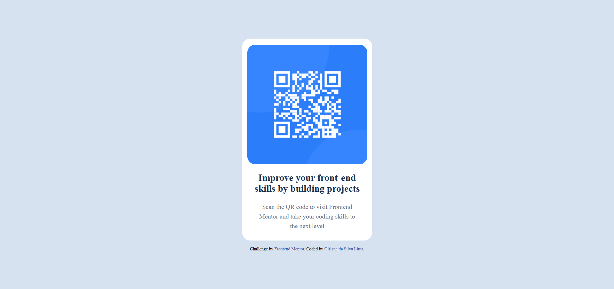

# Frontend Mentor - QR code component solution

This is my solution to the [QR code component challenge](https://www.frontendmentor.io/challenges/qr-code-component-iux_sIO_H) on Frontend Mentor. This project helped me practice writing semantic HTML and building responsive layouts using modern CSS techniques.

## 📸 Screenshot

> 💡 Tip: To take your own screenshot, open the project in your browser, right-click the page and select "Take screenshot", or use a browser extension like FireShot.

---

## 🔗 Links

- [Solution URL](https://github.com/GirlaneSL/qr-code-challenge)
- [Live Site URL](https://girlanesl.github.io/qr-code-challenge)

---

## 🛠️ Built with

- Semantic HTML5
- CSS3 with custom properties
- Flexbox
- Google Fonts: Outfit

---

## 🧠 What I learned

- How to set up the viewport for proper responsive behavior
- How to center content vertically and horizontally using Flexbox and `height: 100vh`
- How to structure CSS cleanly using variables and modular styles